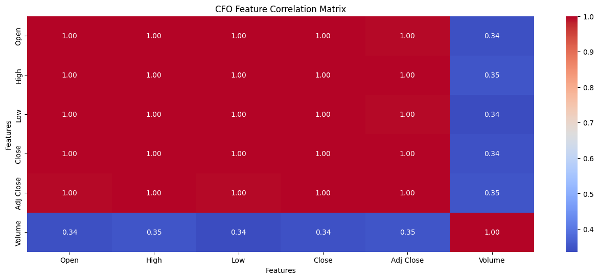
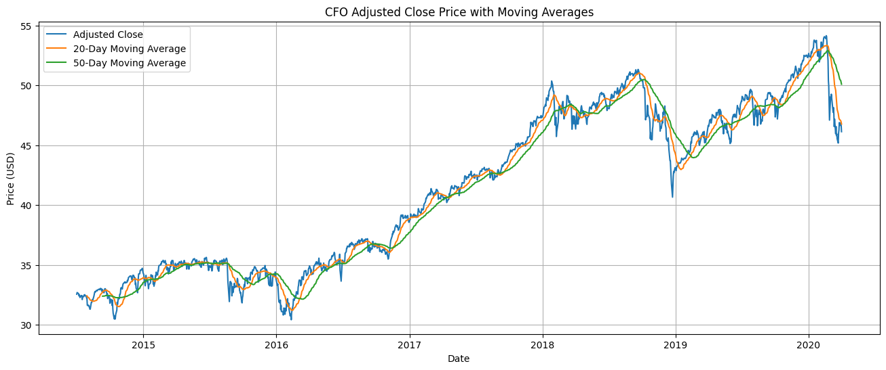
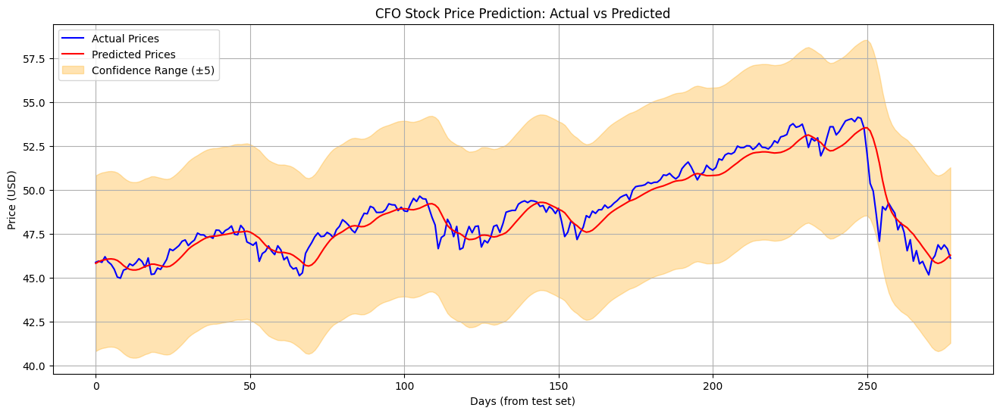
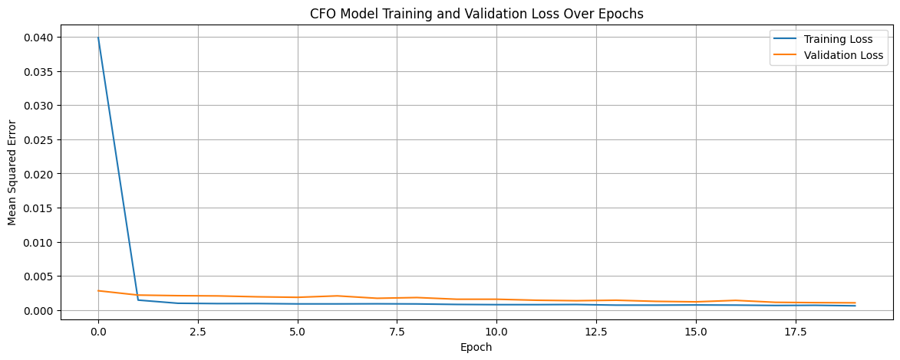
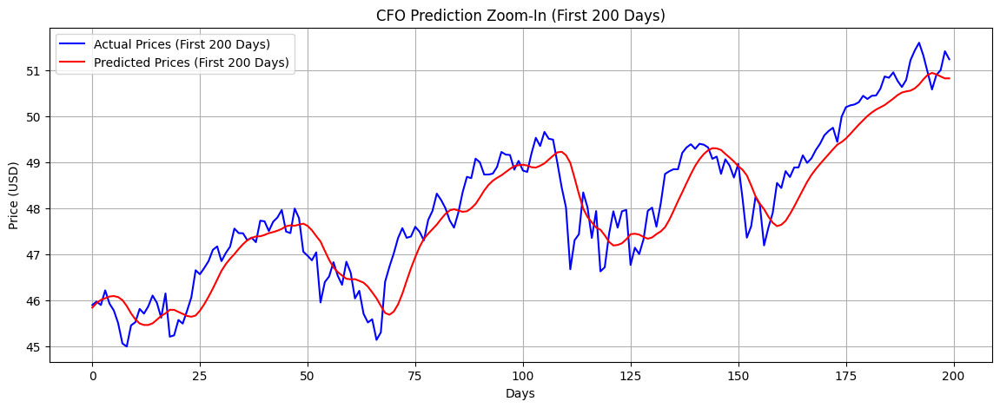
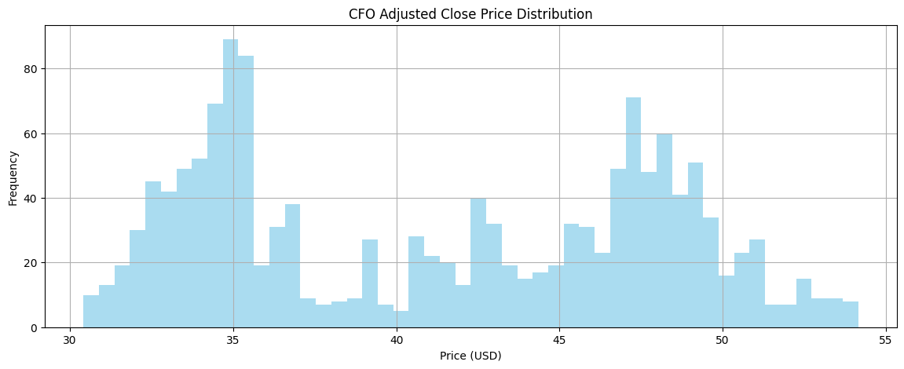

# FUTURE_ML_02 - LSTM-Based Stock Price Prediction

## Project Overview
This project is part of the **Future ML** program and focuses on predicting stock prices using historical ETF data.  
We use **Long Short-Term Memory (LSTM)** neural networks, a type of recurrent neural network, to forecast the **Adjusted Close** prices of the **CFO ETF** based on time series data.

Technologies used include **Python**, **Pandas**, **Seaborn**, **Matplotlib**, **Scikit-learn**, and **TensorFlow/Keras**.

---

## Tools and Libraries
- Python
- Pandas (data handling)
- NumPy (numerical operations)
- Matplotlib & Seaborn (visualizations)
- Scikit-learn (scaling and evaluation)
- TensorFlow/Keras (LSTM model)

---

## Dataset
- **Source**: [Stock Market Dataset from Kaggle](https://www.kaggle.com/datasets/jacksoncrow/stock-market-dataset/data) 
- **Location**: `/etfs/CFO.csv`  
- **Contents**: Date-wise stock market features like Open, High, Low, Close, Volume, and Adjusted Close.

---

## Workflow Summary

1. **Data Loading**  
   Load ETF data and parse the `Date` column.

2. **EDA and Visualizations**

   ### 📊 Correlation Matrix  
   

   ### 📈 Price with Moving Averages  
   

3. **Preprocessing**  
   - Use `MinMaxScaler` to normalize data.  
   - Create sequences of 60 timesteps for LSTM input.

4. **Model Building**  
   - Two-layer LSTM with Dense output.
   - Optimized with Adam and trained using MSE.

5. **Evaluation**

   ### 🎯 Actual vs Predicted Prices  
   

   ### 📉 Loss Over Epochs  
   

   ### 🔍 Zoomed-In Prediction (First 200 Days)  
   

6. **Price Distribution**

   ### 📊 Adjusted Close Histogram  
   

7. **Evaluation Metrics**  
   - **Mean Squared Error (MSE)**: *0.7921*  
   - **Root Mean Squared Error (RMSE)**: *0.8900*  
   - **Mean Absolute Error (MAE)**: *0.7547*

---

## Folder Structure(after downloading datasets)
```
FUTURE_ML_02/
├── etfs/
│   ├── CFO.csv
│     .
│     .
│     .
|   └── other csv files
├── images/
│   ├── 01_correlation_matrix.png
│   ├── 02_price_with_moving_averages.png
│   ├── 03_actual_vs_predicted_prices.png
│   ├── 04_loss_over_epochs.png
│   ├── 05_zoomed_prediction_first_200_days.png
│   └── 06_price_distribution_histogram.png
├── .gitignore
├── README.md
├── requirements.txt
└── stock_prediction.ipynb

```

---

## How to Run

1. Clone the repository:
   ```bash
   git clone https://github.com/yourusername/FUTURE_ML_02.git
   ```
2. Install the dependencies:
    ```bash
    pip install -r requirements.txt
    ```
3. Run the notebook:
    ```bash
    jupyter notebook stock_prediction.ipynb
    ```
4. Recommendation:
    ```bash
    "If you're using TensorFlow 2.12.0 (as in your project), use Python 3.8, 3.9, or 3.10.
    Python 3.11 is supported from TensorFlow 2.13 and above."
    ```

---


## Future Improvements
- Hyperparameter tuning.
- Use multi-feature input (e.g., OHLC).
- Try GRU, ARIMA, Transformer models.

---

## Author
- [Adnan Rahman Sayeem]
- Connect with me on [LinkedIn](https://www.linkedin.com/in/adnan-rahman-sayeem/)

---

## Acknowledgements
- Thanks to [Kaggle](https://www.kaggle.com/datasets/jacksoncrow/stock-market-dataset/data) and ETF data providers.
- TensorFlow/Keras ecosystem.
- This project is part of the Future ML initiative.
